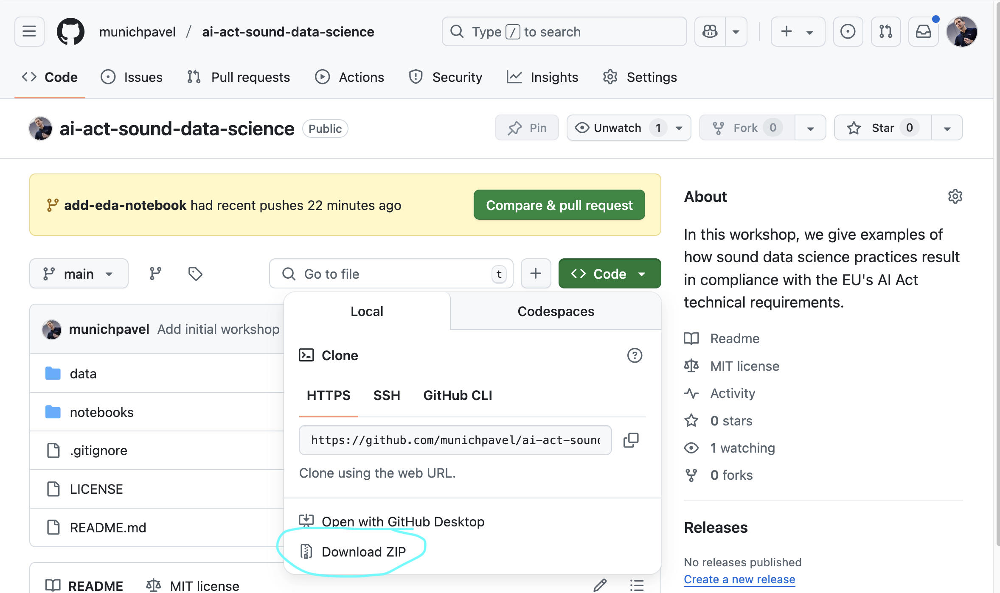
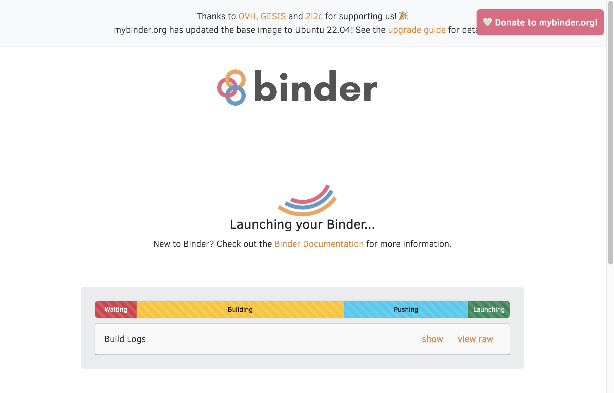
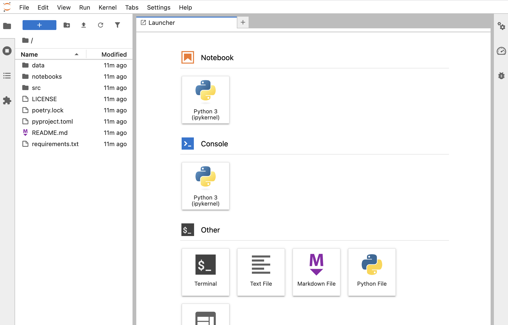

# Material for the workshop "Sound data science and AI regulation"

## Getting started

### Running the workshop notebooks

### Option 1, local installation

First download the repository code in a local folder of your choice, either via `git clone`ing with

```shell
git clone https://github.com/munichpavel/ai-act-sound-data-science.git
```

or by downloading a zipped-version of this repo by pressing "Download ZIP" under the "Code" button context-menu:



Next, `cd` into the created folder containing this repository.

Finally, to install python dependencies,

* create a virtual environment (recommended)  e.g. with [venv](https://docs.python.org/3/library/venv.html), [conda](https://docs.conda.io/en/latest/) or other.
* install python dependencies with `pip install -r requirements.txt` in a virtual environment.


### Option 2, remotely using [binder](https://mybinder.readthedocs.io/en/latest/index.html#)


To open this repository in your own binder instance, click
[](https://mybinder.org/v2/gh/munichpavel/ai-act-sound-data-science.git/HEAD)

While binder is launching, you should see something like



Once it has launched (this can take a couple of minutes the first time), you should see the repository contents from a Jupyter notebook (or lab) IDE:



### Other options

[Google Colab](https://colab.research.google.com), but it seems for our workshop's required functionality, you either have to hacky manual stuff or authorize Colab access to your *entire* Google drive.

## Resources

* [Introduction to data science, Slavko Žitnik and Erik Štrumbelj](https://fri-datascience.github.io/course_ids/handbook/)