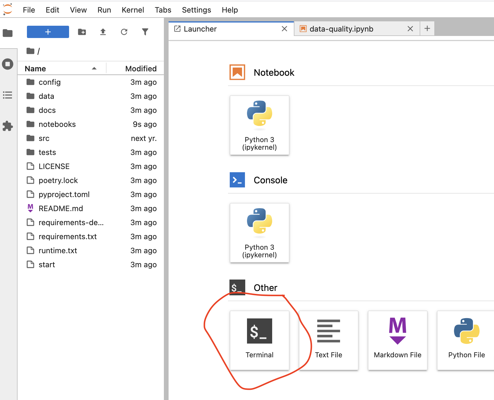

# Material for the workshop "Sound data science and AI regulation"

## Getting started

### Running the workshop notebooks

### Option 1, local installation

**Warning**: [ydata-profiling](https://docs.profiling.ydata.ai/latest/) install with python 3.13 [fails](https://github.com/munichpavel/ai-act-sound-data-science/actions/runs/15579643423/job/43871658179), so either use python 3.12 or lower, or [Option 2](#option-2-remotely-using-binder), below.

First download the repository code in a local folder of your choice, either via `git clone`ing with

```shell
git clone https://github.com/munichpavel/ai-act-sound-data-science.git
```

or by downloading a zipped-version of this repo by pressing "Download ZIP" under the "Code" button context-menu:


Next, `cd` into the created folder containing this repository.

Finally, to install python dependencies,

* create a virtual environment (recommended)  e.g. with [venv](https://docs.python.org/3/library/venv.html), [conda](https://docs.conda.io/en/latest/) or other.
* activate your virtual environment, and install python dependencies with `pip install -r requirements.txt -r requirements-dev.txt`.

In summary, in your local folder of choice, run

```shell
git clone https://github.com/munichpavel/ai-act-sound-data-science.git
cd ai-act-sound-data-science
python -m venv .venv
source .venv/bin/activate
pip install -r requirements.txt -r requirements-dev.txt
```

If using the python standard library's [venv](https://docs.python.org/3/library/venv.html), these steps, run one by one, would look something like

```shell
➜  workshop-clones git:(main) ✗ git clone https://github.com/munichpavel/ai-act-sound-data-science.git
Cloning into 'ai-act-sound-data-science'...
remote: Enumerating objects: 39, done.
remote: Counting objects: 100% (39/39), done.
remote: Compressing objects: 100% (24/24), done.
remote: Total 39 (delta 10), reused 33 (delta 7), pack-reused 0 (from 0)
Receiving objects: 100% (39/39), 812.23 KiB | 6.45 MiB/s, done.
Resolving deltas: 100% (10/10), done.
➜  workshop-clones git:(main) ✗ cd ai-act-sound-data-science
➜  ai-act-sound-data-science git:(main) python -m venv .venv
➜  ai-act-sound-data-science git:(main) ✗ source .venv/bin/activate
(.venv) ➜  ai-act-sound-data-science git:(main) ✗ pip install -r requirements.txt -r requirements-dev.txt
Collecting ydata-profiling
  Downloading ydata_profiling-4.16.1-py2.py3-none-any.whl (400 kB)
     ━━━━━━━━━━━━━━━━━━━━━━━━━━━━━━━━━━━━━━━━ 400.1/400.1 KB 5.7 MB/s eta 0:00:00
Collecting pandas
  Downloading pandas-2.3.0-cp39-cp39-macosx_11_0_arm64.whl (10.8 MB)
     ━━━━━━━━━━━━━━━━━━━━━━━━━━━━━━━━━━━━━━━━ 10.8/10.8 MB 69.6 MB/s eta 0:00:00
Collecting notebook
  Downloading notebook-7.4.3-py3-none-any.whl (14.3 MB)
     ━━━━━━━━━━━━━━━━━━━━━━━━━━━━━━━━━━━━━━━━ 14.3/14.3 MB 59.5 MB/s eta 0:00:00
Collecting pytest
  Downloading pytest-8.4.0-py3-none-any.whl (363 kB)
     ━━━━━━━━━━━━━━━━━━━━━━━━━━━━━━━━━━━━━━━━ 363.8/363.8 KB 50.0 MB/s eta 0:00:00
...
```

To launch a jupyter notebook server and client, run from local repository root `jupyter notebook`:

```shell
(.venv) ➜  ai-act-sound-data-science git:(main) ✗ jupyter notebook
[I 2025-06-11 09:09:55.011 ServerApp] jupyter_lsp | extension was successfully linked.
[I 2025-06-11 09:09:55.015 ServerApp] jupyter_server_terminals | extension was successfully linked.
...
```

If you want to use the provided, custom module `workshop` in `src/workshop`, then you will need to additionally

1. Copy `.envrc.example` to `.envrc` and enter your project's root directory location
1. Source `.envrc`
1. Run `pip install -e .` (or without the `e` if you don't want to make changes)

### Option 2, remotely using [binder](https://mybinder.readthedocs.io/en/latest/index.html#)


To open this repository in your own binder instance, click
[](https://mybinder.org/v2/gh/munichpavel/ai-act-sound-data-science.git)

While binder is launching, you should see something like


Once it has launched (this can take a couple of minutes the first time), you should see the repository contents from a Jupyter notebook (or lab) IDE:


Note: If you want to use a custom module in the repo, you will have to manually install it.

Open a terminal by clicking as shown below:



and enter `pip install -e .`.

### Other options

[Google Colab](https://colab.research.google.com), but it seems for our workshop's required functionality, you either have to hacky manual stuff or authorize Colab access to your *entire* Google drive.

## Resources

* [Introduction to data science, Slavko Žitnik and Erik Štrumbelj](https://fri-datascience.github.io/course_ids/handbook/)